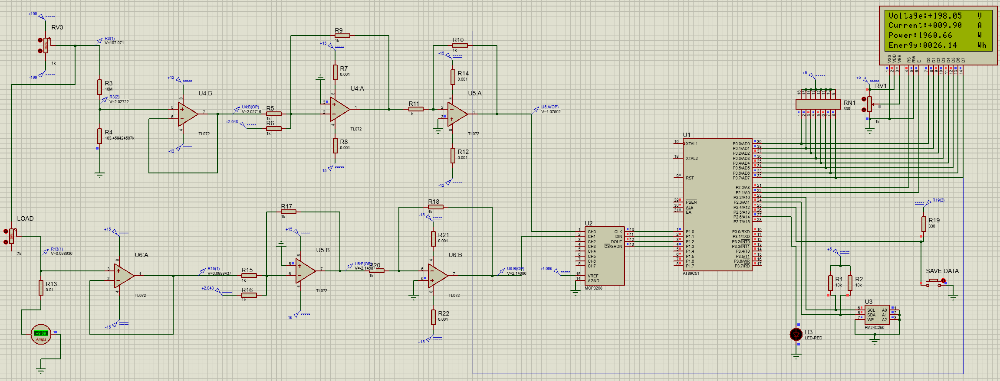

# energy_meter
An energy meter design based on 8051 MCU

Features:
- The circuit was built using Proteus v8.11.
- The code is written in C.
- SPI protocol implemented for MCP3208 A/D.
- I2C protocol implemented for EEPROM 24C256.
- Sampling time 1ms.
- Displays Voltage, Current, Power and Energy.

